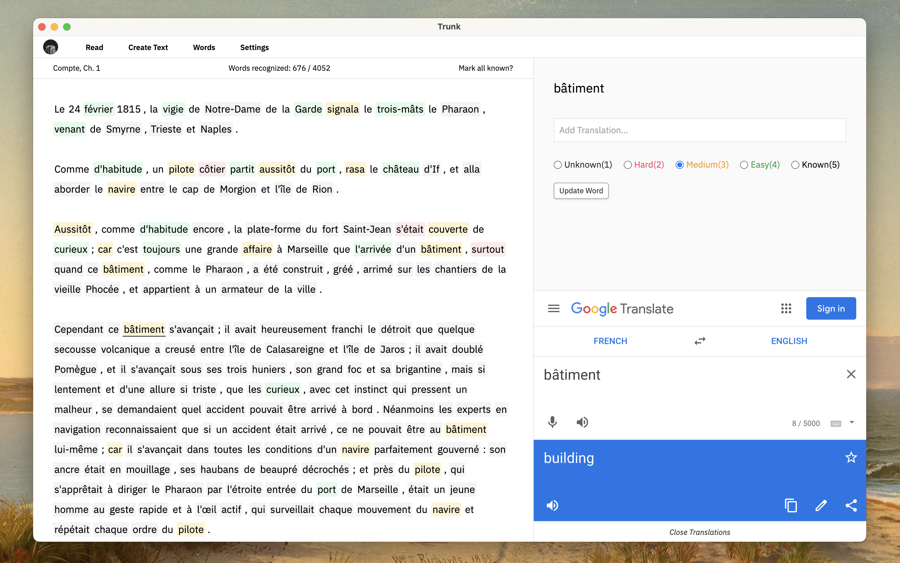

Trunk is an early prototype of a tool for learning new languages. It
is inspired by [Learning With Texts](https://learningwithtexts.com/).

View more screenshots [here](./docs/screenshots).

⚠️ Trunk is currently under development and is not recommended for personal use.
With that said, it currently works as so:

1. Download the [latest release](https://github.com/theiceshelf/trunk/releases) for your platform.
2. Find and create an article to practice reading (preferrably something short).
3. Read the article while marking the familiarity of works and adding translations.

### Development

Requirements:

- Node JS 14+ + Yarn.
- Java runtime (for clojurescript compilation)

**Emacs**

1. Clone repo.
1. run `yarn install`
1. Open a clojurescript file (such as main/core.cljs)
1. Run `m-x cider-jack-in-clojurescript`
1. Follow the prompts to run a `shadow` repl (and `node-repl`).
1. Open your build running on `http://localhost:9630/dashboard`
1. Navigate to "Builds"
1. Press `Watch` button for `main` and `renderer` builds.
1. Run `npm run dev-electron` in a new terminal.

**In Terminal**

1. Clone repo.
1. `npm install`
1. In one terminal run `npm run dev-cljs`
1. Open your build running on `http://localhost:9630/dashboard`
1. Navigate to "Builds"
1. Press `Watch` button for `main` and `renderer` builds.
1. In another terminal, run `npm run dev-electron`

Note: from time to time you will likely need to restart the `npm run
dev-electron` process if you make stateful changes to certain variables that are
only defined once, at boot.
